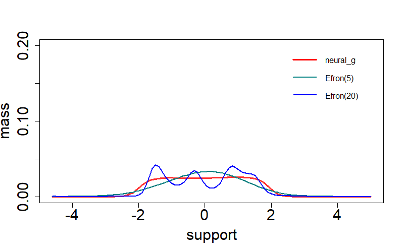

# NetNPMLE
An R package for implementing Neural-Network based g-modeling, neural_g in short.

## Abstract 
neural_g is a flexible nonparametric maxium likelihood estimator (NPMLE) based on deep neural network for latent mixture model. neural_g is free of tuning hyperparameters and is capable of estimating a smooth or shapely discrete shape of latent distribution.

## Installation
To run the neural_g smoothly, there are several pre-requisites needed to be installed before the R package. The main of Net-NPMLE is worte in `Python`, especially __Pytorch__ library and we strongly recommend using `CUDA` (GPU-Based tool) to train Net-NPMLE which can be accelerated a lot than using `CPU`.
- __Python__ 3.7 or above
- __[Pytroch](https://pytorch.org/)__ 1.11.0 or above
- __[NAVID CUDA](https://developer.nvidia.com/cuda-toolkit)__ 10.2 or above

In R, we also need `reticulate` package to run `Python` in R and `devtools` to install R package from github.
```
install.package("reticulate")
install.package("devtools")
```

Now, use the following code to install `neuralG` package.
```
library(devtools)
install_github(repo = "shijiew97/neural-g")
library(neuralG)
```
## Main function
There are two main functions in the `Net-NPMLE` package, which is detailed specified below.
- `neural_g` aims to give out neural_g estimator in uni-variate mixture model. Currently neural_g supports mixutre models such as Gaussian-location, Poisson-mixture, Lognormal-location, Gumbel-location, Gaussian-scale, Binomial-prob.
- `neural_g2` provides bi-variate neural_g estimator in bi-variate mixture model. Currently bi-variate neural_g supports Gaussian location-scale mixture model.

#### Example (1) : Lognormal-location (Beta) mixture.
As a simple example of `neuralG` pacakge, we consider a Lognorm-location mixture: $\mathbf{Y} \mid \theta \sim \text{Log-normal}(\theta, 1/5) \text{ and }  \theta \sim \text{Beta}(3,2)$ where latent distribution follows $\text{Beta}(3,2)$ have a support of $[0,1]$ and $n=2,000$.

```{r, eval=FALSE}
Seed <- 128783;set.seed(Seed);dist <- "LogGaussian";param <- 0.2
n <- 2000;L <- 5;num_it <- 4000;n_grid <- 100
theta <- rbeta(n, 3, 2);Y = rlnorm(n, theta, param)
net_g <- neural_g(Y=Y, param=param, dist=dist, n=n, num_it=num_it, n_grid=n_grid)
plot(net_g$support, net_g$prob, col=rgb(1,0,0,0.8), type='l',
     xlab='support', ylab='mass', lwd=3, ylim=c(0, 0.5), cex.axis=1.85, cex.lab=1.85)
```


#### Example (2) : Gaussian-location (Uniform) mixture.
Here we also consider [Efron's](https://github.com/bnaras/deconvolveR/) $\widehat{g}$ estimator in a Gaussian-location (Uniform) mixutre: $\mathbf{Y} \mid \theta \sim \mathcal{N}(\theta,1) \text{ and } \theta \sim \mathcal{U}\text{nif}(-2,2)$ where $n=2,000$.

```{r, eval=FALSE}
Seed <- 128783;set.seed(Seed);dist <- "Gaussian";param <- 1.0
n <- 4000;L <- 5;num_it <- 4000;n_grid <- 100
theta <- runif(n, -2, 2);Y = theta + rnorm(n, 0, param)
net_g <- neural_g(Y=Y, param=param, dist=dist, n=n, num_it=num_it, n_grid=n_grid)
plot(net_g$support, net_g$prob, col=rgb(1,0,0,0.8), type='l',
     xlab='support', ylab='mass', lwd=3, ylim=c(0,0.2), cex.axis=1.85, cex.lab=1.85)
efnpmle = deconvolveR::deconv(tau=net_g$support, X=Y, deltaAt=0, family="Normal", pDegree=5, c0=1.0)
efnpmle20 = deconvolveR::deconv(tau=net_g$support, X=Y, deltaAt=0, family="Normal", pDegree=20, c0=0.5)
lines(net_npmle$support, efnpmle$stats[,"g"], type="l", xlab="", ylab="", col=rgb(0,0.5,0.5), lty=1, lwd=2)
lines(net_npmle$support, efnpmle20$stats[,"g"], type="l", xlab="", ylab="", col=rgb(0,0,1), lty=1, lwd=2)
legend("topright", c("nueral_g","Efron(5)","Efron(20)"),
        col=c(rgb(1,0,0),rgb(0,0.5,0.5),rgb(0,0,1)), lty=c(1,1,1),
        lwd=c(3,2,2,2,2), bty="n", cex=1.0, x.intersp=0.8, y.intersp=0.8)
```



#### Example (3) : Bi-variate Gaussian location-scale mixture
In this case, we explore the application of bi-variate neural_g in a Gaussion location-scale mixture model: $\pi(\mu,\sigma^2) \sim \text{Normal-inverse-gamma}(\mu=1,\sigma=1,\text{shape}=2,\text{scale}=0.5)$.

```{r, eval=FALSE}
Seed <- 128783;set.seed(Seed);dist <- "Gaussian2s";param <- 0.5
n <- 1000;L <- 5;num_it <- 4000;n_grid <- 50;p <- 2
mu <- 1;sigma <- 1; shape <- 2;scale <- 0.5
Y <- matrix(0, n, p)
theta1 <- MCMCpack::rinvgamma(n, shape, scale)
theta2 <- rnorm(n, mu, sd = sqrt(theta1 * sigma^2))
for(i in 1:n){Y[i,] <- theta2[i]+theta1[i]*rnorm(p)}
net_g <- neural_g2(Y=Y, param=param, dist=dist, n=n, num_it=num_it, n_grid=n_grid, p=p)
mu_support <- unique(net_g$support[,1])
sig_support <- unique(net_g$support[,2])
mu_prob <- rep(0, n_grid);sigma_prob <- rep(0, n_grid)
for(i in 1:n_grid){
     mu_prob[i] <- sum( net_g$prob[net_g$support[,1]==mu_support[i]] )
     sigma_prob[i] <- sum( net_g$prob[net_g$support[,2]==sig_support[i]] )
}
plot(mu_support, mu_prob, col=rgb(1,0,0,0.8), type='l', xlim=c(-3,4),
     xlab='support', ylab='mass', lwd=3, ylim=c(0,0.35), cex.axis=1.85, cex.lab=1.85)
lines(sig_support, sigma_prob, col=rgb(0,0,1,0.8), type='l', lwd=3, lty=2)
legend(x=2.0, y=0.385, c(expression(mu),expression(sigma^2)),
       col=c(rgb(1,0,0),rgb(0,0,1)), lty=c(1,2), lwd=c(3,3),
       bty="n", x.intersp=0.5, y.intersp=0.8, seg.len=1.0, cex=1.85)
```


